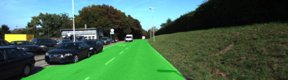
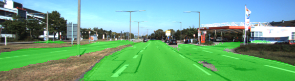
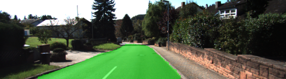
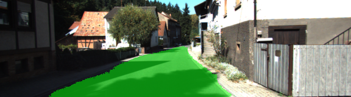
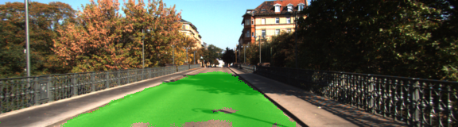

# Udacity Self-Driving Car Nano-Degree
---
### Semantic Segmentation
John Mansell
---
> 
### Objective
> 
> 
> The goal of this project is to emulate the rusults from 
[Fully Convolutional Networks for Semantic Segmentation](https://arxiv.org/pdf/1605.06211.pdf) by Shelhamer et al.
Their neural network was able to extend the pretrained vgg-16 model in order to add spatial information to the network.
Shelhamer et al. was able to achieve pixel by pixel classification of images. This project attempts to provide pixel by
pixel recognition of road / not-road pixels in a series of images taken from a car driving along the road.
>
# Methods
> 
### Architecture
> The pre-trained vgg-16 model was downloaded and used as the starting point. Input, layer 3, 4 and 7 tensors
were all extracted from the original graph. These layers were passed to the layers function. The layers function
built new layers following the architecture in the original paper.
>
> First, I did a 1x1 2d convolution on each of layers 3, 4 and 7. Next, I up-sampled the convolution from layer 7. I 
also added a skip layer, which was the sum of the up-sampled layer and the layer4 convolution layer. Then I added
another up-sampling layer, a conv 2d transpose of the skip layer, followed by another skip layer. Finally, the last skip
layer was up-sampled by taking a kernel of 16 with a stride of 8.
>
### Training
> The Neural Network was trained using an Adam Optimizer on a softmax cross entropy with logits function. The images and
pixelwise labels were provided by Udacity.
> 
### Tuning
> After testing a number of different Hyper Parameters, the values that I used were:  
> * L2_REG = 1e-3  
> * STDEV = 1e-2  
> * KEEP_PROB = 0.8  
> * LEARNING_RATE = 1e-4
> 
> * EPOCHS = 30  
> * BATCH_SIZE = 8  
> * IMAGE_SHAPE = (160, 576)  
> * NUM_CLASSES = 2  
> *Note, I would have preferred to use a larger batch size, but the GPU memory caused a crash when I used a batch size 
greater than 8.*
> 
# Sample Output
>
> A video of the output images can be found at [video_8.avi](video_8.avi)
> 
>   
> 
> 
> 
> 
> 
> 
> 

# Acknowledgements
> The whole project is based on recreating the neural network described in the paper by Shelhamer et al.
> 
> The foundation of the project was based on the walkthrough provided by Udacity's Q and A video, as well as the
classroom lessons.  
> 
> I referenced some of the other iterations of the FCN8 architechture on github for help understanding the structure 
and order of the different layers. Specifically 
[Jeremy Shannon's project](https://github.com/jeremy-shannon/CarND-Semantic-Segmentation)
 and [ooleksyuk's project](https://github.com/ooleksyuk/CarND-Semantic-Segmentation) who had an excellent example of
 running the project on the cityscape database in addition to the KITI dataset.
 >
 > James K Le also has a great [article](https://medium.com/nanonets/how-to-do-image-segmentation-using-deep-learning-c673cc5862ef)
 on medium that helped me understand the structure of the project, and the overview of Semantic Segmentation.
 >
 > Finally, none of this would have been possible without the lessons from the Udacity Classroom and teachers.