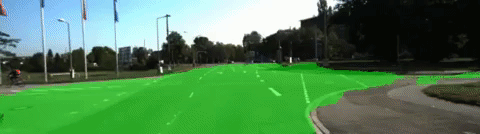

# Semantic Segmentation
>   
> [Full Video](https://youtu.be/B5XBFSqmUrg) on YouTube

# Objective
> Label the pixels of a road in images using a Fully Convolutional Network (FCN).

# What I Learned
> - Advanced deep learning
> - Fully convolutional networks
> - Scene Understanding
> - Inference performance
> ### Languages
> - C++
## [Write Up](WriteUp/WriteUp.md)  
